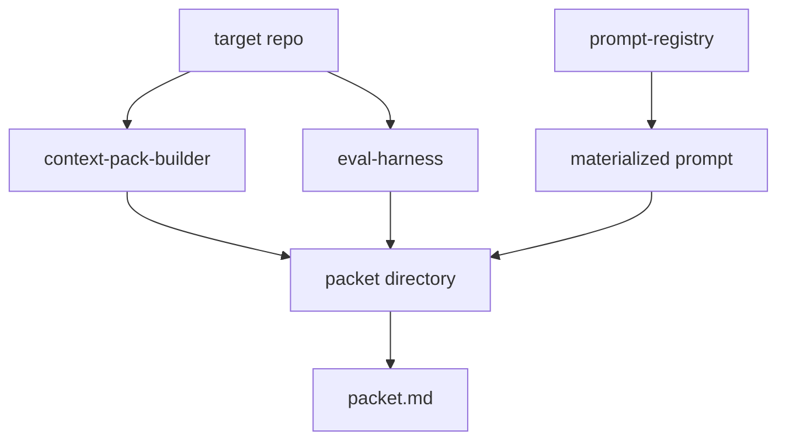

# Architecture

`review-packet-builder` is a local Ruby CLI that consumes the existing tooling
repos without linking to their internals.

## Components

- `CLI`
  - parses user options
  - selects prompt id, output directory, and sibling tool roots
- `PacketBuilder`
  - runs `context-pack-builder`
  - runs `eval-harness` in Markdown and JSON modes
  - runs `prompt-registry materialize`
  - writes the packet directory
- `PacketIndex`
  - renders one summary file for a human or cheap model
  - exposes readiness summary, non-pass rules, artifact links, and executed
    commands

## Data Flow

## Boundary Choices

- The builder shells out to sibling CLIs instead of embedding their code.
- The packet format is file-based and local, not a service response.
- The index is intentionally shallow; deep repo truth still lives in the
  generated artifacts.

## Why This Is Not A Gateway

The current workspace pressure is packet assembly, not remote runtime behavior.
There is no proven need yet for:

- hosted prompts
- auth
- model routing
- request persistence
- policy enforcement

Until one concrete consumer needs those capabilities, a local packet builder is
the smaller and more truthful integration asset.
